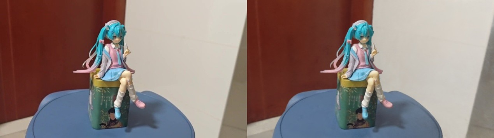

# Nerf-nerfacto-3Dgauss


你可以在这里下载模型的数据：[cloud link](https://pan.baidu.com/s/17tCQ6Vk_we6_n6yAyr7v2g?pwd=z7dh) 提取码: z7dh

## Colmap

我们使用colmap对视频进行建模

<p align="center">
  
</p>

我们使用`ffmpeg`对视频进行分帧

```
ffmpeg -i miku.mp4 -qscale:v 2 images/frame_%04d.png
```

### colmap 特征提取

```
colmap feature_extractor --database_path database.db --image_path images
```

### colmap 特征提取

```
colmap exhaustive_matcher  --database_path database.db
```

### 稀疏重建

```
mkdir sparse
colmap mapper --database_path database.db --image_path images --output_path sparse
```

### 导出相机参数为3DGS所需格式

```
colmap model_converter --input_path sparse/0 --output_path output --output_type TXT
```


## Nerf

我们的nerf采用[nerf-pytroch](https://github.com/yenchenlin/nerf-pytorch)版本的实现

对于nerf-pytorch,我们采用了blender格式作为输入，因此采用了7:1:3的train:val:test的数据集划分

可以修改`view_tensorboard_file.sh`的内容来查看Tensorboard的内容，Tensorboard存储了训练中每500个epoch推理val的图像，Tensorboard的内容，可以在百度网盘中下载

训练的配置文件在`path\to\Nerf-nerfacto-3Dgauss\nerf-pytorch\configs\colmap.txt`中记录


使用`train_nerf.sh`来开始训练


### Tensorboard

可以修改`view_tensorboard_file.sh`的内容来查看Tensorboard的内容，Tensorboard存储了训练中每500个epoch推理val的图像，Tensorboard的内容，可以在百度网盘中下载

```
./view_tensorboard_file.sh
```

我们的渲染效果如下


## **Nerfacto**

要使用nerfacto，首先创建虚拟环境

```
conda create --name nerfstudio python=3.8 -y
conda activate nerfstudio
```

在官网上找到合适的版本的pytorch&torchvision&cuda

进入`./nerfacto`

```
pip install -e .
```

开始训练:
```
ns-train nerfacto --data data/miku_process --max-num-iterations 60000 --vis viewer+tensorboard
```

下图中，左图为ground truth 右图为nerfato渲染结果



## 3D Gaussian Splatting

### 创建环境
```
cd ./gaussian-splatting
conda env create -f environment.yml
conda activate gaussian_splatting
```

如果opencv-python无法安装
```
conda install opencv
```

### train

```
python train.py -s data/miku_process  --eval
```

### test

将网盘中的test文件夹放入文件夹中
```
python metrics.py --model_paths .
```

### 实验结果


<p align="center">
  
</p>